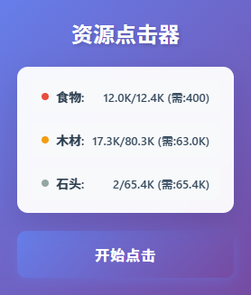

# Evolve 资源快速收集工具

一个为 [Evolve](https://pmotschmann.github.io/Evolve/) 游戏设计的浏览器扩展，帮助玩家快速收集食物、木材和石头资源。


## 功能特性

- 🎯 **智能资源收集**：自动识别并收集食物、木材、石头三种资源
- 📊 **实时资源监控**：显示当前资源数量、最大容量和需要收集的数量
- 📈 **进度显示**：实时显示收集进度，让操作更直观
- 🎨 **精美界面**：现代化UI设计，玻璃态效果和流畅动画
- ⚡ **高效执行**：优化的点击算法，快速完成资源收集
- 🔢 **智能计算**：自动计算需要收集的资源数量，避免过度点击
- 🚫 **K单位支持**：智能识别并转换K单位（如11.5K = 11500）

## 游戏背景

[Evolve](https://pmotschmann.github.io/Evolve/) 是一个增量游戏，玩家需要收集各种资源来发展文明。本工具专门针对游戏中的基础资源收集功能进行优化，帮助玩家节省时间，专注于游戏策略。

## 安装方法

### Chrome/Edge 浏览器

1. 下载本项目到本地
2. 打开Chrome/Edge浏览器
3. 访问 `chrome://extensions/` (Chrome) 或 `edge://extensions/` (Edge)
4. 开启右上角的"开发者模式"
5. 点击"加载已解压的扩展程序"
6. 选择本项目文件夹 `EvolveTools`

### Firefox 浏览器

1. 下载本项目到本地
2. 打开Firefox浏览器
3. 访问 `about:debugging#/runtime/this-firefox`
4. 点击"临时载入附加组件"
5. 选择本项目中的 `manifest.json` 文件

## 使用方法

1. 打开 [Evolve](https://pmotschmann.github.io/Evolve/) 游戏
2. 点击浏览器工具栏中的插件图标
3. 查看当前资源状态（食物、木材、石头）
4. 点击"开始点击"按钮
5. 等待进度条完成
6. 资源收集完成后，插件会自动更新资源信息

## 界面说明

### 资源信息面板
- **食物**（红色标识）：显示当前食物数量/最大容量（需要数量）
- **木材**（橙色标识）：显示当前木材数量/最大容量（需要数量）
- **石头**（灰色标识）：显示当前石头数量/最大容量（需要数量）

### 操作按钮
- **开始点击**：开始资源收集操作
- 点击过程中按钮会显示"点击中..."并禁用
- 完成后自动恢复

### 进度条
- 显示当前收集进度百分比
- 实时更新，带有流畅动画效果
- 完成后自动隐藏

## 技术实现

### 核心功能
- 使用 Chrome Extension Manifest V3 规范
- 通过 `chrome.scripting.executeScript` API 注入脚本
- 智能解析资源数量，支持K单位转换
- 顺序执行点击操作，确保进度准确

### 资源识别
插件会自动识别以下游戏元素：
- `#cntFood`：食物数量显示
- `#cntLumber`：木材数量显示
- `#cntStone`：石头数量显示
- `#city-food a`：食物收集按钮
- `#city-lumber a`：木材收集按钮
- `#city-stone a`：石头收集按钮

## 注意事项

### 使用建议
- 确保在游戏页面使用插件
- 建议在资源接近满仓时使用，效果最佳
- 避免频繁重复使用，以免影响游戏体验

### 兼容性
- 支持 Chrome 88+ 版本
- 支持 Edge 88+ 版本
- 支持 Firefox 78+ 版本（需使用临时加载方式）

### 性能考虑
- 大量点击时可能会导致浏览器短暂卡顿
- 建议在电脑性能较好时使用
- 如遇到问题，请刷新页面后重试

## 开发说明

### 项目结构
```
EvolveTools/
├── manifest.json      # 扩展配置文件
├── popup.html         # 弹出窗口界面
├── popup.js          # 主要逻辑代码
└── README.md         # 项目说明文档
```

### 技术栈
- HTML5 + CSS3
- Vanilla JavaScript
- Chrome Extension API

## 更新日志

### v1.0.0 (2026-03-24)
- 初始版本发布
- 支持基础资源收集功能
- 实现实时资源监控
- 添加进度显示功能
- 精美UI界面设计

## 许可证

本项目仅供学习和个人使用。请勿用于商业用途。

## 免责声明

本工具仅用于辅助游戏体验，不保证在所有情况下都能正常工作。使用本工具产生的任何后果由使用者自行承担。建议遵守游戏规则，合理使用。

## 联系方式

如有问题或建议，欢迎通过以下方式联系：
- 提交 Issue
- 发送 Pull Request
- Email：virtualman@yeah.net
---

**享受游戏，合理使用工具！** 🎮